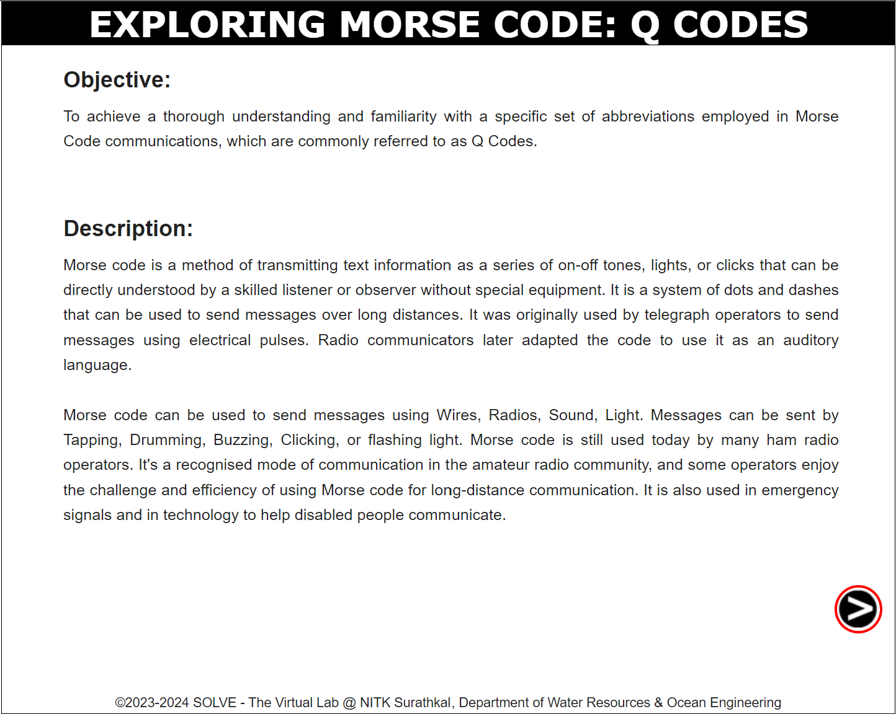
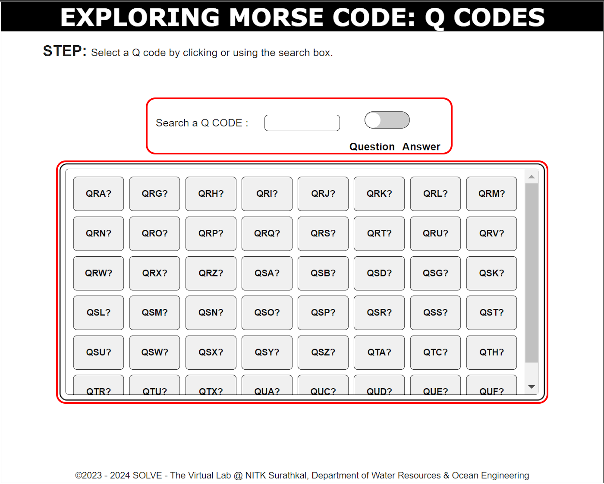
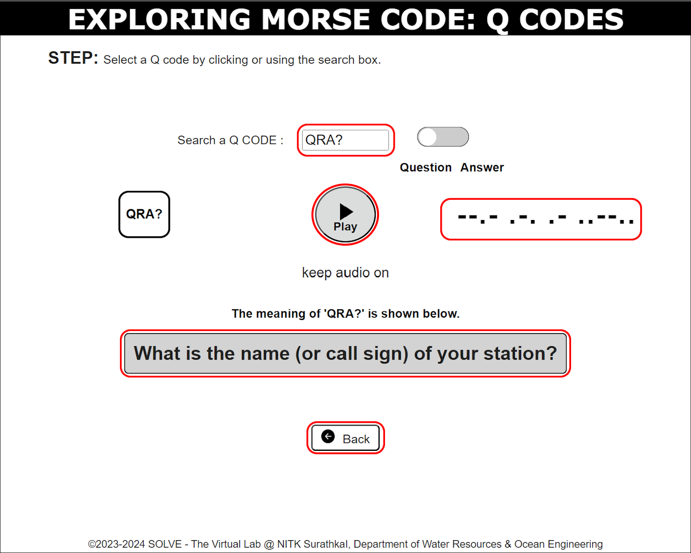

### These procedure steps will be followed on the simulator

1. Open the Q-codes simulation and go through the Objective and Description, then click the 'NEXT' button in the bottom right corner.

   

2. Use the input box to search for a Q-code, or select one directly from the table. If you need to switch between the Q-code question and answer, click the toggle button.

   

<!-- #### IF ALPHABETS SELECTED: -->

3. Once a Q-code is selected, its meaning will be displayed. To generate the Morse code for the selected Q-code, click the 'Play' button. To repeat the process with a different Q-code, click the back button, enter a new Q-code in the input box, and select it from the table.

   

